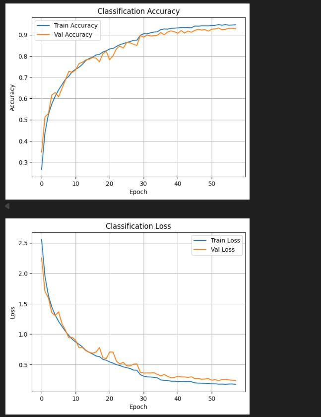

# 🧠 Object Detection CNN – 26 Classes

This project is a **custom-built Convolutional Neural Network (CNN)** model for object classification across **26 different object categories**. The model has been trained using cropped COCO-format annotated datasets and achieves **over 93% accuracy** on unseen test data.

---

## 🔍 Project Highlights

- 📦 **Dataset:** Custom object detection dataset (cropped from COCO annotations)
- 🎯 **Classes:** 26 real-world object categories
- 🧠 **Model:** Custom CNN (no pretrained models used)
- 🧪 **Accuracy:** Final Test Accuracy: **93.34%**
- 📊 **Precision:** 93.41% | **Recall:** 93.34% | **F1 Score:** 93.23%
- 🔮 **Predictions:** Supports both individual image predictions and batch predictions from folders

---

## 📂 Folder Structure

OBJECT-DETECTION-26-CLASSES/
│
├── Output/
│ ├── Confusion Matrix.jpg
│ ├── Google Images Predictions.jpg
│ ├── Graphs.jpg
│ └── Test Images Predictions.jpg
│
├── final_code.ipynb
├── object_detection_final_model.h5
├── requirements.txt
└── README.md 

## 📷 Visual Results

### ✅ Accuracy & Loss Graphs  


### ✅ Confusion Matrix  


### ✅ Test Predictions  


### ✅ Real-world Image Predictions  


---

## 🚀 How to Run

### 1. 📦 Install Dependencies
```bash
pip install -r requirements.txt


2. ▶️ Run the Notebook
Open final_code.ipynb and run all cells to:

Train the model (optional – already trained)

Load and predict on test images

Predict on real-world images

3. 💾 Pretrained Model
Use object_detection_final_model.h5 for inference without retraining.


🧠 Supported Classes (Example)

['bus', 'car', 'bicycle', 'tree', 'door', 'bench', 'traffic light', ...]


👤 Author
Rushikesh Kadam
Final Year BTech | AI & Data Science
Project: Real-World Multi-Class Object Classification using CNN